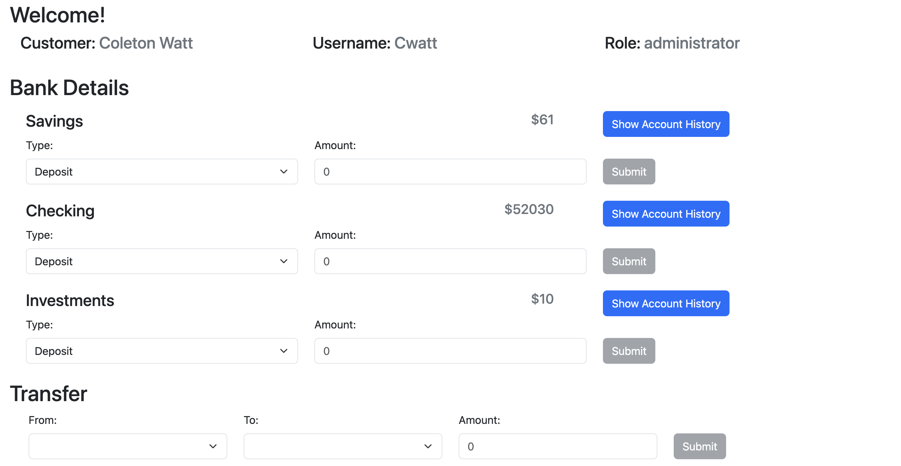
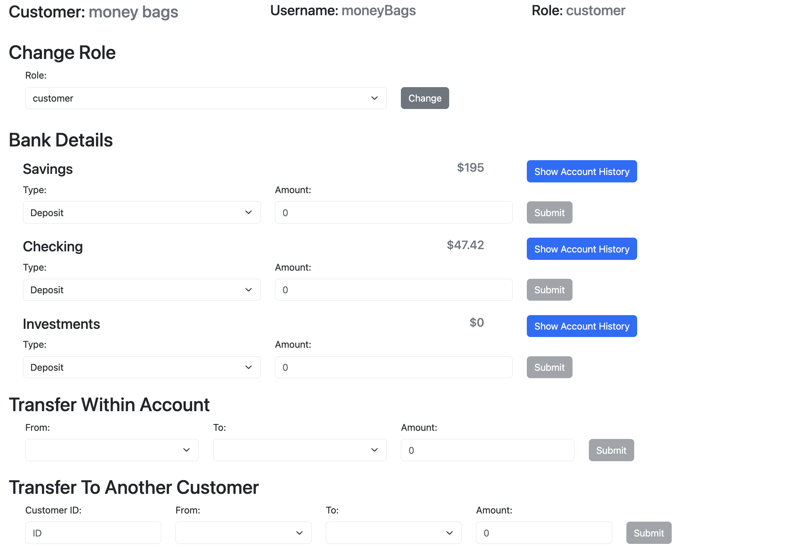
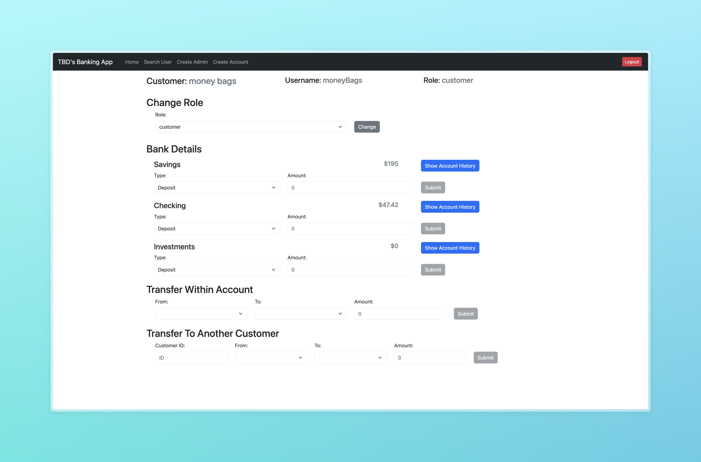

# TBD Banking App

## Description

A website based project showcasing the skills of Brody Gardner, Cooper Maitoza, and Coleton Watt. It has a fully featured backend, database, and frontend.

### Brody Gardner

- Worked on allowing users to create, manage and log in to any account
- Outlined and Managed the requirements for the project
- Implemented a hashing system to keep users account safe
  
### Cooper Maitoza

- Worked on allowing employees and administrators to search, manage, and edit users
- Worked closely with Coleton to have a cohesive web page
- Built a navbar to allow users to seamlessly navigate the website
- Implemented the ability for users to transfer funds across accounts

### Coleton Watt

- Worked on allowing user to mange and update there accounts
- Worked closely with Cooper to build a cohesive website
- Implemented backend routes to allow the deposit, and withdraw and transfer of customer funds

## Technologies

- MongoDB - Used to store the users data featuring JSON data
- React + Bootstraps - Used to build a functional website that is fully responsive web page based on the screen size
- Express + Cors - Used to make a great backend including routes for all the user interactions

## Screenshots

